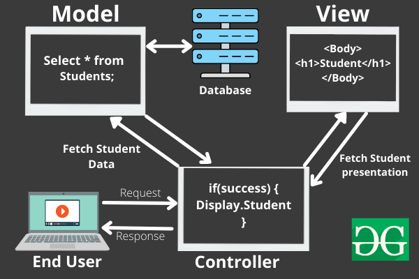

# my-interview-prep

### **_HTML_**

• What is the purpose of the doctype declaration?

The DOCTYPE declaration is an instruction to the web browser about what version of HTML the page is written in. This ensures that the web page is parsed the same way by different web browsers.

• Explain the difference between `<div>` and `<span>`.

`<div></div>` element is for organising content in a block level structure. It takes full width of the screen or the width of the parent. It always start in a new line.
`<span></span>` element is for organising content in a inile level. It wrap around a part of the text, links or an image.

• What Is Semantic HTML?

HTML tags that convey the meaning of the content contained within them.For example, tags like `<header>, <article>, <footer>` are semantic HTML tags. They clearly indicate the role of the content they contain.
It is useful for screen readers as it convey the role, also developers can also easily identify each section by its name, also helps in SEO.

• Self closing tag vs closing tag

Closing tags are the tags which contain contents,Eg; `<p><div><span>`.</br>
Self-closing tags are the tags which cann't have contents, instead they are pointers to an element installed on the website. Eg;`<input/></br>`

• What is the Difference between HTML Elements and Tags?

An HTML element consists of a start tag, some content, and an end tag. You can also have attributes in your tags such as class or id name.
Tag consists of an opening bracket and a closing bracket or it can be a self closing tag as well.

• What is meta tag? its properties

The <meta> tag defines metadata about an HTML document. Used to specify character set, page description, keywords, author of the document, and viewport settings. Metadata is used by browsers (how to display content or reload page), search engines (keywords), and other web services.</br>
It's properties are: charset, content, http-equiv, name.

```
Define keywords for search engines:
<meta name="keywords" content="HTML, CSS, JavaScript">

Define a description of your web page:
<meta name="description" content="Free Web tutorials for HTML and CSS">

Define the author of a page:
<meta name="author" content="John Doe">

Refresh document every 30 seconds:
<meta http-equiv="refresh" content="30">

Setting the viewport to make your website look good on all devices:
<meta name="viewport" content="width=device-width, initial-scale=1.0">

```

• Difference between document.createElement vs document.createFragment

The child nodes of the document fragment are inserted into the DOM where you put the fragment, but the fragment itself is not inserted. It is useful for grouping but don't want parent in DOM. </br>
On the other hand, when you create an element and append it to the DOM, both the element and its children are appended.

• Diff b/w b and strong

bold just modifies the text, whereas strong tells screen readers that there is emphasis going on.

• Diff heading tag and difference?

```<H1>``` is the largest heading level while ```<H6>``` is the smallest heading level. Help to highlight the most important information. They are also useful for impaired visitors who are using screen readers. html headings can also help to improve your SEO.

• What is webworker api in html?

When executing scripts in an HTML page, the page becomes unresponsive until the script is finished.
A web worker is a JavaScript that runs in the background, independently of other scripts, without affecting the performance of the page. You can continue to do whatever you want: clicking, selecting things, etc., while the web worker runs in the background.


### **_CSS_**

• What is mean by cascading style sheet?

Read this doc https://www.udacity.com/blog/2021/07/what-is-css-cascading-style-sheets-explained.html

• What is the box model in CSS?

For very element, a box is wrapped around them. It has four parts; content, padding, border, margin.</br>
Content: Is the area where text & images are incuded.<br />
padding: A space around content. It is transparent.<br />
Border: A border is surrounded to the padding & content.<br />
Margin: A space aruond the border. It is transparent.<br />
If we set a width & height to the element. The actual width and height of the element is calculated by adding the space taken for padding and border.<br />
So, totalWidth = width + leftPadding + rightPadding + leftBorder + rightBorder.<br />
totalHeight = height + topPadding + bottomPadding + topBorder + bottomBorder.<br />
The box width & height stops at the border.<br />


• Describe the difference between margin and padding.

Margin is space around the border. It is usefull wen you want to make a space between elements or position an element. Margin allow auto setting and negative values. Also, it can be used for overlapping on another element by setting negative values. It will not impacted by styling of other elements.<br />
Padding is the space between the border and the content. It is usefull to expand the space of the content with the border. For eg; add space between text and the border of a button. There is no auto settin and negative values in padding. It can be impacted by styling of other elements.

• CSS display:none and visibility:hidden – What's the Difference?

display:none and visibility:hidden are two style declarations you can use to hide elements on the screen with CSS.</br>
display:none removes the element as well as the space taen for that element</br>
visibility:hidden hides the elements without changing their layouts</br>
opacity:0 causes the elements to be very transparent but users can still interact with them.</br>

• What is CSS object model?

The CSS Object Model is a set of APIs allowing the manipulation of CSS from JavaScript. It is much like the DOM, but for the CSS rather than the HTML. It allows users to read and modify CSS style dynamically.

• What is critical rendering path?

The rendering process of the CSS Object Model and the DOM is done within the browser and is called the critical rendering path. It is the process or series of steps the browser goes through to convert the HTML, CSS, and JavaScript into pixels that display on the screen.

• What is CSS preprocessor?

A CSS preprocessor is a program that lets you generate CSS from the preprocessor's own unique syntax.

• What is SASS/SCSS preprocessor?

SASS/SCSS is a CSS preprocessor that runs on the server and compiles to CSS code that your browser understands.</br>
SASS - Syntactically awsome style sheet</br>
SCSS - Sassy Cascading Style Sheets

• Why to use SASS instead of CSS ?

Sass is much rich in features than CSS, like variables, nested rules, mixins, imports, inheritance, built-in functions, and other stuff.

• Why to use SCSS instead of CSS ?

SCSS uses fewer lines of code than CSS, which makes the code load faster. Standard CSS doesn't support nesting. There is no way to write a class inside another one. SCSS supports nested syntax.


• Specificity in css

Think of specificity as a score/rank that determines which style declaration is ultimately applied to an element. Below is the “specificity hierarchy,” which lists selector types from the highest specificity to the lowest specificity.

  1. ID selectors: ID selectors are the most specific kind of selector. They select an element based on its ID attribute (e.g., #my-id).
  2. Class selectors, attribute selectors, and pseudo-class selectors: These three selector types have equal specificity.
    - Class selectors select all elements in a CSS class (e.g., .my-class).</br>
    - Attribute selectors select all elements with a given attribute (e.g., p[target]).</br>
    - Pseudo-class selectors select elements only when in a special state, like visited or hover (e.g., button:hover).</br>
  4. Type selectors: These select all HTML elements that have a given node name and have the syntax element (e.g., div).
  5. Universal selector: The universal selector (*) has no effect on specificity.

Rule 1: The CSS selector with higher specificity applies.</br>
Rule 2: If CSS selectors have equal specificity, then the last rule in the document applies.</br>
Rule 3: Inline CSS has the highest specificity.</br>

In CSS, the !important property overrides all other declarations on an element, even inline declarations.

• Difference between position:absolute, relative, static and fixed

### **_CSS Flexbox_**

• What is the flexbox model, and how does it work?


It allow us to arrange the divs. The parent should have a display:flex property to consider it as a flexbox model. display:block align the child divs in each line by taking enitre width of the container. But display:flex by default align the child div inline.


We can set the direction by using flex-direction:row/column property. Bydefault it will be row. Another option to change the order div and the postion by setting flex-direction:row-reverse/column-reverse. All these works on the main axis or x-axis. Even for column. It just make the x-axis to verticaly align.


To align items in the main axis, can use jstify-content:flex-start/flex-end/centre/space-between/space-around.
The space-between equaly add space between the child divs and fill the container. The space-around add equal space between child also add calculate half of the space between the two child divs and add it to before first child div and after last child div. So there will be a gap between the container and the first and last child divs.


To align items in cross-axis, use align-items:flex-start/flex-end/centre/stretch/baseline. Stretch will take up the entire cross axis for the child div. Baseline, moves childs to up of the cross-axis.
To manipulate one of the child divs, use align-self:flex-start/flex-end/centre/stretch/baseline. It affects only to that partiular div not every child div.


• Explain the purpose of justify-content and align-items in flexbox.<br />

To align items in the main axis, can use jstify-content:flex-start/flex-end/centre/space-between/space-around.
The space-between equaly add space between the child divs and fill the container. The space-around add equal space between child also add calculate half of the space between the two child divs and add it to before first child div and after last child div. So there will be a gap between the container and the first and last child divs.


To align items in cross-axis, use align-items:flex-start/flex-end/centre/stretch/baseline. Stretch will take up the entire cross axis for the child div. Baseline, moves childs to up of the cross-axis.
To manipulate one of the child divs, use align-self:flex-start/flex-end/centre/stretch/baseline. It affects only to that partiular div not every child div.


### **_CSS Grid_**

• How does CSS Grid differ from Flexbox?

Flexbox is 1D. So it can be arranged either in row direction or column direction. It is useful for creating simple layouts with single row or single column.
Grid is 2D. It can control both row and column arrangement simultaneuosly. It is usefull to create more complex layout.

• Explain the use of the grid-template-columns property.<br />

To set the width of each column in grid. It can be set using grid-template-column:w1 w2 w3 or grid-template-column:repeat(no.Column, width).
https://www.freecodecamp.org/news/css-grid-tutorial-with-cheatsheet/#the-justify-items-property

### **_Responsive Design_**

• What is the importance of media queries in responsive design?

Using media queries, a website can be optimised by changing the layout & content for various screen size. Also, it can improve the performance by loading only neccessary features and styles. It makes the website more faster. Responsiveness helps to avoid horizontal scrolling, distorted images. It makes the application more user friendly and flexible to different screen size.

• Describe the difference between em and rem units in CSS.

Both are units of measurement of font size. `em` font size is relative to its parent's font size. Eg; If the parent font size is 16px then 1em of the child is equal to 16px. 0.5em of the child is equal to 8px(half of the parent's font size)
The `rem` font size is relative to the base font-size or root font. By default the root font or document font size is 16px, so in this case if any text with 1rem is equal to 16px.<br />
.parent {
font-size: 16px;
}

.child-em {
font-size: 1em; /_ equal to 16px, relative to parent font size _/
}

.child-rem {
font-size: 1rem; /_ equal to 16px, relative to base font size _/
}

• em tag vs i tag

i tag is for adding italics style to text. em tag add italics as well as more emphasis/ importance to the text.

• Variable declaretion in SASS, SCSS, CSS?

```
<variable>: <expression>

=== SCSS SYNTAX ===
$base-color: #c6538c;
$border-dark: rgba($base-color, 0.88);

.alert {
  border: 1px solid $border-dark;
}

=== SASS SYNTAX ===
$base-color: #c6538c
$border-dark: rgba($base-color, 0.88)

.alert
  border: 1px solid $border-dark

=== CSS SYNTAX === var()
:root {
  --blue: #1e90ff;
  --white: #ffffff;
}
.container {
  color: var(--blue);
  background-color: var(--white);
}
```

### **_JavaScript Basics_**

• What is DOM?

When a web page is loaded, the browser creates a Document Object Model of the page.
The HTML DOM model is constructed as a tree of Objects:</br>
</br>
With the object model, JavaScript gets all the power it needs to create dynamic HTML:</br>
JavaScript can change all the HTML elements in the page
JavaScript can change all the HTML attributes in the page
JavaScript can change all the CSS styles in the page
JavaScript can remove existing HTML elements and attributes
JavaScript can add new HTML elements and attributes
JavaScript can react to all existing HTML events in the page
JavaScript can create new HTML events in the page

• What are the types in JS?

1. String
2. Number
3. Bigint - To store integer values that are too big to be represented by a normal JavaScript Number.
4. Boolean
5. Undefined
6. Null
7. Symbol
8. Object

• What are the Falsy Values in JavaScript?

false, null, undefined, 0, empty string; ''/``/"", NaN. All the values except these are cosidered as truthy.
A way to check whether a value is falsy or not is to use the Boolean() function.

```
console.log(Boolean(false))
console.log(Boolean(0))
console.log(Boolean(""))
console.log(Boolean(null))
console.log(Boolean(undefined))
console.log(Boolean(NaN))

o/p
----
for everything it will print false.
```

The following are some of those values that aren't falsy but may appear as such.

```
console.log(Boolean('false')) // An empty object
console.log(Boolean(' ')) // An empty object
console.log(Boolean('0')) // An empty object
console.log(Boolean([])) // An empty array
console.log(Boolean({})) // An empty object

o/p
----
for everything it will print true.
```

All non-empty strings in JavaScript are truthy values including strings with only whitespace.

• Explain the concept of hoisting in JavaScript.

Hoisting is a phenomena in which variables and functions can be accessed before its initialisation.

[](https://www.youtube.com/watch?v=Fnlnw8uY6jo)

Eg:

```
getName();
console.log(x)
var x=10;
function getName(){
  console.log('Anu Thomas');
}

o/p
----
Anu Thomas
undefined
```

• What is the difference between let, const, and var?

Both let and const variables are hoisted. Hoisted means, if we try to access those variables before its initialisation it will throw <i>reference error: variable *_* cannot be accessed before its initialisation.</i> It is due to we are trying to access it when they are in temporal deadzone.<i>Temporal dead zone start from variable declaration to initialisation.</i> Both the variable can not be redeclared in the same scope. It will throw<i>reference error: variable *_* being already declared.</i> Both are block scoped so can not access those variables outside the block. Let variable can be declare first and later initialise with a value. const variable must initialised with a value otherwise throw <i>syntax error: missing initializer in const declaration. </i>The value of a const can't be changed through reassignment using the assignment operator, but if a constant is an object, its properties can be added, updated, or removed. Var variable can be redeclared in the same scope. It is functional scoped, so can not accessible outside function. Can declare first and later initialise with a value. It is not hoisted, so accessing before initilisation will return undefined not any errors.

Eg:

```
var x;
console.log(x);
x=10;
console.log(x)
function sample(){
  var x = 1000;
  let a ;
  a =100;
  const b = 'Hello'
  console.log(a,b)
  const c;
  c='test'
  console.log(c)
}
sample()
console.log(x)


o/p:
----
undefined
10
100 Hello
syntx error:missing initialiser in const declaration
10
```

• How js achieve asynchrous behaviour

In JavaScript, there are three common ways to work with asynchronous operations: promises, async/await,callbacks.</br>
callback: It is a function that executes after the outer code call has finished running. It is supplied as an input to another function.</br>
Promise: An object representing eventual completion or failure of an asynchronous operation.</br>
async/await: It is a JavaScript technology that allows you to create asynchronous code more synchronously. Chaining promises together can become quite clumsy and confusing. For this reason, async and await were developed. It handles promises.

• What is intersection observer in js?</br>
[](https://youtu.be/2IbRtjez6ag)</br>
The Intersection Observer API is a browser API which watches for changes that intersect with the viewport and then executes a callback function in the code. It takes 2 params; a callback function and optional object with 3 properties(threshold, root, rootmargin).

• What is `this` keyword in js?

In JavaScript, the this keyword refers to an object. The object depends on how this is being invoked (used or called). this === context</br>
In an object method, this refers to the object.</br>
Alone, this refers to the global object.</br>
In a function, this refers to the global object.</br>
In an event, this refers to the element that received the event.</br>

• What is lexical scope & scope chain?

Scope refers to the area where an item (such as a function or variable) is visible and accessible to other code.</br>
JavaScript's scope chain determines the hierarchy of places the JS must go through to find the origin of the specific variable that got called.

• map vs forEach

Both are for iterating over an array. Map returns an array where forEach returns nothing. The returned value of foreach will be undefined.

• shallow copy vs deep copy

Shallow Copy:

  - Shallow copy creates a new object and copies the references of the original object’s elements into the new object.
  - The new object references the same memory locations as the original object for its elements.
  - If any changes are made to the shared elements in the new or original object, the changes will be reflected in both.
  - Shallow copy is a relatively faster operation and requires less memory.
  - Shallow copy is suitable when you want to create a new object, but you don’t need independent copies of the elements.

  ```
  const cars = [{company: 'Maruti', model: 'Alto'}, {company: 'Tata', model: 'Nano'}];
  const newCars = [...cars]; //shallow copy
  newCars[0].model = 'Swift';  
  console.log(newCars); //[{company: 'Maruti', model: 'Swift'}, {company: 'Tata', model: 'Nano'}]
  console.log(cars); //[{company: 'Maruti', model: 'Swift'}, {company: 'Tata', model: 'Nano'}]
  ```

Deep Copy:

  - Deep copy creates a new object and recursively copies the elements of the original object, including any objects referenced within it.
  - The new object has its own memory locations for all the elements, including the referenced objects.
  - Changes made to the elements in the deep copy do not affect the original object or any other copied objects.
  - Deep copy is a relatively slower operation and requires more memory, especially for complex data structures.
  - Deep copy is suitable when you want to create a completely independent copy of an object, including all its nested objects.

  ```
  const cars2 = [{company: 'Maruti', model: 'Alto'}, {company: 'Tata', model: 'Nano'}];
  const newCars2 = JSON.parse(JSON.stringify(cars2)) //deep copying
  newCars2[0].model = 'Benz' 
  console.log(newCars2); //[{company: 'Maruti', model: 'Benz'}, {company: 'Tata', model: 'Nano'}]
  console.log(cars2); //[{company: 'Maruti', model: 'Alto'}, {company: 'Tata', model: 'Nano'}]
  ```

• callback hell

Callback hell is a phenomena where a Callback is called inside another Callback. It is the nesting of multiple Callbacks inside a function. If you look at the design of the code, it seems just like a pyramid. Thus the Callback hell is also referred to as the ‘Pyramid of Doom’. The callback hell makes it harder to understand and maintain the code. For eg; we need to perform task A. To perform A task, we need some data from the task B. Similarly; we have different tasks that are dependent on each other and execute asynchronously. Thus, it creates a series of callback functions.
```
function print(i){
    window.alert("This is call number "+i);
}

function fun1(callback){
    setTimeout(()=>{
    
        let i = 1 ;
        callback(i); i++ ;
        setTimeout(()=>{
     
      	    callback(i); i++;
      	    setTimeout(()=>{
        
        	    callback(i); i++ ;
        	    setTimeout(()=>{
          
          		    callback(i); i++ ;
          		    setTimeout(()=>{
            
            		    callback(i); i++ ;
            		    // .... and so on
            		    
          		    }, 800)
        	    }, 700)
      	    }, 500)
        }, 300)
    }, 100)
}

// Calling fun1 with print function as parameter
fun1(print);
```
• Diff b/w normal script, async, differ

When you load a web page there are two things happening.
  - html parsing
  - loading the scripts
      - fetching the scripts from network
      - executing scripts line by line

In normal script, html parsing will goes and stops when it encounter a script. Then the scripts will be
fetched completely and started executing it. After script execution over the html parsing will be continued.</br>
In async script, html parsing will goes and along with  that scripts will be fetched asynchronously. After
fetching all the scripts. The html parsing will be stopped and scripts execution starts. After completing
script execution html parsing will be continued.</br>
In defer script, html parsing will goes and finish the parsing completely. While doing that scripts will also be fetched asynchronously but scripts will start execution only after html parsin is over.</br>
</br>

• Local storage, session storage, cookies

Web storage api is used for storing data into the browser. This data will be a key value pair of strings.
There are two ways to store data in browser; one is by localstorage and another is session storage.</br>

Session storage: The data will be only available till the session is available. The session will start as soon as the user visit the website. It will lost the data if the user close the window or the ta in which the session is available. The session storage has larger capacity than cookies. It can store minimum 5MB of data.</br>
Local storage: The data will be persisted forever. It won't lost the data if the user closes the window/tab or even shutdown the system. Local storage has higher capacity than session storage. The memory capacity is totaly depends on the device which user is using. It is usefull for AB/testing, optimizing web
app performance.</br>
Cookies:The data is stored in the server. So to access it, have to make network call between client and server. The storage capacity is very less, 4000 bytes only.</br>

PS:The storage api follows same origin policy due to security concern. It make sure user is accessing same port, protocol, domain/host.</br>
Eg; http://abcd.in/data.php</br>
https://abcd.in/data.php  //protocol changed from http to https. So it is wrong</br>
http://rinta.in/data.php  //domain changed. So it is wrong.</br>
http://abcd.in/data.php:8888 //port changed. So it is wrong.</br>

• HOC and HOF

HOC: Takes a component as its argument and returns a new component that wraps the original component.
It is useful for reusing component logic across multiple components.It is usefull for authentication, logging data, styling and theming.</br>

HOF: Takes a function as its argument and returns a new function.</br>
Higher order functions can help improve the legibility of your code by making it more concise and easy to understand. This can help speed up the development process and make it easier to debug code. Second, higher order functions can help organize your code into smaller chunks, making it easier to maintain and extend.</br>

• What is typeof null,undefined,number,string,array,object,bigint,symbol and boolean value?

- typeof null = 'object'
- typeof undefined = 'undefined'
- typeof 123 = 'number
- typeof [1,3,2] = 'object'
- typeof {a:12, b:'fdg'} = 'object'
- typeof 'hello' = 'string'
- typeof Symbol = 'function'
- typeof BigInt = 'function'
- typeof true = 'boolean'

• What is prototype in js?

- Prototype property is basically an object (also known as Prototype object), where we can attach methods and properties in a prototype object, which enables all the other objects to inherit these methods and properties.
- JavaScript is a prototype based language, so, whenever we create a function using JavaScript, JavaScript engine adds a prototype property inside a function.

• What is Prototype Inheritance in JavaScript?

- Prototype inheritance in javascript is the linking of prototypes of a parent object to a child object to share and utilize the properties of a parent class using a child class.
- refere: https://javascript.info/prototype-inheritance

```
// Creating a parent object as a prototype
const parent = {
  greet: function() {
    console.log(`Hello from the parent`);
  }
};

// Creating a child object
const child = {
  name: 'Child Object'
};

// Performing prototype inheritance
child.__proto__ = parent;

// Accessing the method from the parent prototype
child.greet(); // Outputs: Hello from the parent
```

### \***\*JavaScript Functions:\*\***

• What is a closure in JavaScript?

A function along with its lexical scope or a function binds together with its lexical enviornment.

[](https://www.youtube.com/watch?v=qikxEIxsXco)

Eg:

```
function parent(){
  let a = 123;
  funtion child(){
    console.log(a)
  }
  return child;
}

let out = parent();
out();

o/p:
----
123 //here, child fn is in closure. Out is able to print 123 since child is stored along with its parent()
lexical enviornment
```

Eg2:

```
function sample(){
  let a = 'hello'
  setTimeout(() => {
    console.log(a)
  },3000)
}
o/p:
----
hello //printed after 3ms
```

• Explain the differences between arrow functions and regular functions.

In case of regular function, we can call the function before its defenition. Its because JS allocate the memory space for that function along with its function defenition.
In case of arrow function, it should be called after function defenition to work. If it is called it will
return undefined as result because js is treating this function as a variable. So while calling the function before the declaration, memory space is allocated but value or defenition is not available. So the value is initialised with undefined during memory allocation time.</br>
In regular function it has its on this context. But for arrow function, it has this value from its surrounding or lexical context in which arrow function is created.

```
Eg:
const myObj = {
  regular: function (){
    console.log('REGULAR:',this)
  },
  arrow: () => {
    console.log('ARROW:',this)
  }
}
myObj.regular();
myObj.arrow();
```

## o/p

</br>

In regular function constructor can be created and use value of this. But it is not possible in arrow function as its this value is defined based on its lexical enviornment.

```
function regularfn(name,age){
    this.name = name;
    this.age = age;
    console.log(this)
}
new regularfn('Rinta',27);

const arrowfn = (name,age) => {
    this.name = name;
    this.age = age;
    console.log(this)
}
new arrowfn('Nithin', 29)

o/p
----
regularfn {name: 'Rinta', age: 27}
Uncaught TypeError: arrowfn is not a constructor
```

• adv of arrow function?

- makes the code more readable and reducing the amount of boilerplate code.
- This value inside an arrow function is automatically inherited from the surrounding context. It eliminates the need to use bind(), call(), or apply() to preserve the this value or deal with this-related issues.
- Arrow functions are well-suited for callback functions, such as event handlers or asynchronous operations.
- Arrow functions provide implicit return behavior for concise one-line functions.

• What is function currying?

A function currying will convert a function with multiple arguments into seperate functions with single argument. So curryied function will take only one param at a time but return another function with one arg. It is constructed by chaining closures by immediately returning inner functions simultaneously.

```
const add = (a) => {
  return function (b) {
    if (b) return add(a + b);
    return a;
  };
};
console.log(add(1)(2)(4)());

o/p
---
7
```

### \***\*DOM Manipulation:\*\***

• How does event delegation work in the DOM?

Event delegation happens in bubbling up phase. So in this, an event listener is attached to the parent element. If the event occure in child it is bubbled up to the parent, grand parent and so on till it reaches the root document.
Adv. of event delegation is that 1)performance improvement:only a single event listener is needed for every child. It will save memory by not attaching individual event listeners to every child element. 2) Support dynamic elements: can add or remove more child elements, by default the event for those child is registered with the parent. 3)Less code: handling a single event listener reduces the code length.

[](https://www.youtube.com/watch?v=3KJI1WZGDrg)

• Explain the purpose of the data- attributes.

It is for storing custom data in semantic html elements. It follows a syntax data-\*. The data can be accessed inside js using dataset property. Also, can be used in css.
Eg;

```
<article
id="content"
name="content"
data-info="business"
data-index-number=3
>.....</article>

<script>
  const article = document.querySelector("#content")
  article.dataset.dataInfo //business
</script>

<style>
  article[data-index=3]{
    color:red;
  }
</style>
```

### **_AJAX_**

• What is AJAX, and how does it work?

AJAX, asynchronous javascript xml: It allow a website update its content without reloading the entire page.</br>
Flow:</br>
browser create a js call -> this call create a XMLHttpRequest object -> sends a request to web server to update data -> the web server process the request -> sends back a response to browser -> the browser uses js to process the response -> directly update the data from the response to html page without reloading
Eg; Google search engine; suggest keyword while typing the search keywords without reloading the page
Eg2; Chat option on website to the customer service. We can continue chating while exploring the site without reloading the page

• Explain the role of the XMLHttpRequest object.

browser create a js call -> this call create a XMLHttpRequest object -> sends a request to web server to update data -> the web server process the request -> sends back a response to browser -> the browser uses js to process the response -> directly update the data from the response to html page without reloading
Eg; Google search engine; suggest keyword while typing the search keywords without reloading the page
Eg2; Chat option on website to the customer service. We cancontinue chating while exploring the site without reloading the page

### **_RESTful API Concepts_**

• What is REST, and how does it differ from SOAP?

SOAP:Simple object access protocole. It follws a protocole or certain rules to get data. It is complex.
REST:Representational state transfer. It follows an architectural style. Easier.
SOAP protocole can be used in rest but not vice versa.

• Describe the common HTTP methods used in RESTful APIs.

Get: retrieve/read data from server</br>
Post: send data to the server to add another entry</br>
Put: update an existing data in the server</br>
patch: update only part of an existing data on the server</br>
Delete: delete the data from server</br>
Head: Read data, but only return header not the body of the response</br>
Options: Read info about the available communication options of the resource</br>

### **_React Basics_**

• JS vs JSX
- .js file contains only javascript.
- .jsx file will have both js and jsx. JSX is a syntactic sugar of the React.createElement() method, that allows developers to write a JS inside HTML.

What is JSON?

- Javascript object notation
- JSON is the replacement of the XML data exchange format in JSON.
- It is light-weighted and supported by almost every language and OS.
- JSON stores all the data in an array so data transfer makes easier. 

• Framework vs Library

--- Library ---
- A library is a group of reusable functions and classes which are used by the developers to perform  several common tasks. 
- While using a library in the program, the user has full control when he uses the functions or classes from the Library.
- The Library helps in linking and the binding process.
- It can be incorporated seamlessly into projects that are in the developing phase.
- React,Jqeury

--- Framework ---
- A framework is basically a piece of code that dictates the architecture or the structure of our project and also adds in our programs.
- In frameworks, code never called into a framework. Instead, the Framework calls you.
- A Framework provides a standard way to develop and deploy applications.
- It cannot be incorporated seamlessly into the developing process. But instead of it, we can use it when we start a new project.
- Angular, Vue.js 

• What is MVC? How it works?

- Model</br>
The model layer is responsible for the application's data logic and storing and retrieving data from back-end data stores. 
- View</br>
The view layer provides the UI necessary to interact with the application. It includes components needed to display the data and enables users to interact with that data. 
- Controller</br> 
The controller layer contains the application logic necessary to facilitate communications across the application, acting as an interface between the view and model layers.



Let’s imagine an end-user sends a request to a server to get a list of students studying in a class. The server would then send that request to that particular controller that handles students. That controller would then request the model that handles students to return a list of all students studying in a class.

The model would query the database for the list of all students and then return that list back to the controller. If the response back from the model was successful, then the controller would ask the view associated with students to return a presentation of the list of students. This view would take the list of students from the controller and render the list into HTML that can be used by the browser.

The controller would then take that presentation and returns it back to the user. Thus ending the request. If earlier the model returned an error, the controller would handle that error by asking the view that handles errors to render a presentation for that particular error. That error presentation would then be returned to the user instead of the student list presentation.


• What is JSX in React?

JSX is a syntax to write html like syntax in js. It is transpiled or converted before it reaches the JSE. It is done by babel pkg.

• Explain the purpose of state in React components.

State in react is a local variable to maintane the state in component. useState() hook is for creating state variable. It re-render the component whenever the state gets updated. If we use normal local variable instead of state this component re-rendering will not happen when it is getting updated.

• What is context api?

context api is used to avoid prop drilling. When we want to pass a prop down to the deeply nested component, it is very difficult and unneccessory to pass that in every other component which is not using that. This can be avoided using context api.
Context API consists of two main components: the context provider and the context consumer. The provider is responsible for creating and managing the context, which holds the data to be shared between components. On the other hand, the consumer is used to access the context and its data from within a component.

```
MyContext.js
import { createContext } from 'react';
export const MyContext = createContext("");

parent.js
import { useState, React } from "react";
import { MyContext } from "./MyContext";
import MyComponent from "./MyComponent";

function App() {
  const [text, setText] = useState("");

  return (
    <div>
      <MyContext.Provider value={{ text, setText }}>
        <MyComponent />
      </MyContext.Provider>
    </div>
  );
}

export default App;

consumer.js
import { useContext } from 'react';
import { MyContext } from './MyContext';

function MyComponent() {
  const { text, setText } = useContext(MyContext);

  return (
    <div>
      <h1>{text}</h1>
      <button onClick={() => setText('Hello, world!')}>
        Click me
      </button>
    </div>
  );
}

export default MyComponent;

```
• What is error boundary in react

Error boundary is a component in React that catches an error within a component tree and prevents it from crashing the application by showing a fallback user interface.

• React vs JS

React is a JavaScript library for building user interfaces, while JavaScript is a programming language used for various web development tasks. React is built on top of JavaScript and provides a structured approach to building UI components. React offers advantages like improved code organization, enhanced performance with the Virtual DOM, easier state management, and a thriving community, making it a powerful choice for modern web development projects. Many popular websites and apps, including Facebook, Instagram, Airbnb, and Netflix, use React to create responsive and interactive user interfaces.

• Dependencies vs Dev dependecy vs Peer dependency?

  - Dependencies are the packages that your project directly depends on to run in production.
  - Dev Dependencies are the packages a developer needs during development. 
  - Peer dependencies are packages your package relies on but expects the consumer to provide. Peer Dependencies are not automatically installed. You need to manually modify your package.json file in order to add a Peer Dependency.
  ```
  "peerDependencies": {
  "react": "¹⁷.0.0",
  "react-dom": "¹⁷.0.0"
  }
  ```

• Difference between tilde ( ~ ) and caret ( ^ ) in package.json

- The tilde (~) notation is employed to match the latest patch version while freezing the major and minor versions.
```
Example: The ~1.2.0 will update all the future patch updates. We have to write just ~1.2.0 and all the next patch update dependencies. For example, 1.2.1, 1.2.2, 1.2.5……………1.2.x.
```

- The caret ( ^ ) automatically updates both minor and patch updates.
```
Example: The ^1.2.4 will update all the future Minor and patch updates, for example, ^1.2.4 will automatically change the dependency to 1.x.x if any update occurs. 
```

### **_React Components_**

• Differentiate between functional and class components in React.

Functional components are javascript functions. It is also called stateless component as it doesn't have their state and lifecycle methods. It is more efficient and easy to code. It uses react's useState() hook to maintane the state and useEffect() hook to handle life cycle methods. It accepts props as input and return jsx as output.

```
import React, { useState } from 'react';

function Example() {
  const [count, setCount] = useState(0);

  function handleClick() {
    setCount(prevCount => prevCount + 1);
  }

  return (
    <div>
      <p>You clicked {count} times</p>
      <button onClick={handleClick}>
        Click me
      </button>
    </div>
  );
}
```

Class components are complex. It is also called as statefull component as it has their own state and lifecycle methods. It has `this` and constructor() to use state. It extends React.component class and has a render() method. The render() method returns jsx. It is less effiecient and more complex to write.

```
import React, { Component } from 'react';

class Example extends Component {
  constructor(props) {
    super(props);
    this.state = {
      count: 0
    };
    this.handleClick = this.handleClick.bind(this);
  }

  handleClick() {
    this.setState(prevState => ({ count: prevState.count + 1 }));
  }

  render() {
    return (
      <div>
        <p>You clicked {this.state.count} times</p>
        <button onClick={this.handleClick}>
          Click me
        </button>
      </div>
    );
  }
}
```

• What is controlled and uncontrolled component

In controlled components form data is handled by a React component. It must have state and we can validate input being changed.

```
import React, { useState } from 'react';

function ControlledForm() {
  const [value, setValue] = useState('');

  const handleChange = (event) => {
    setValue(event.target.value);
  }

  const handleSubmit = (event) => {
    event.preventDefault();
    alert(`input's value: ${value}`);
  }

  return (
    <form onSubmit={handleSubmit}>
      <input type="text" value={value} onChange={handleChange} />
      <button type="submit">Submit</button>
    </form>
  );
}
```

In uncontrolled component form data is handled by the DOM itself and using state is optional there but must use refs to access current value. Also, uncontrolled component cann't validate input being changed.

```
mport React, { useRef } from 'react';

function UncontrolledForm() {
  const input = useRef();

  const handleSubmit = (event) => {
    event.preventDefault();
    alert(`input's value: ${input.current.value}`);
  }

  return (
    <form onSubmit={handleSubmit}>
      <input type="text" ref={input} />
      <button type="submit">Submit</button>
    </form>
  );
}
```

• Describe the lifecycle methods in a React class component.

There are three phases for component life cycle methods

- Mounting
- Updating
- Unmounting
  

React has two stages for each phase:render phase, commit phase.

- Mounting:
  - It occure when component is first created and inserted to the DOM
  - It has 4 methods:constructor(), getDerivedStateFromProps(), render(), componentDidMount()
    - Constructor(): It is for initializing the state and bind its methods to component's instance. Inside constructor super(props) must be done, otherwise the props will be undefined.
    - getDerivedStateFromProps(): It is being called after constructor() before render(). It is for updating the current state based on the changes in props. It should retrun an object to update the state or null.
    - render(): It is for generating the virtual DOM of the component with the current state and props. It is being called each time the state or props changed, or the parents component got re-rendered. It retrun JSX.
    - componentDidMount():It will occure after mounting stage. So that it can fill the data and re-render the component. It is used for making API calls.
- Updating:
- It is being done when component is re-rendered.
- It has 4 methods: getDerivedStateFromProps(), shouldComponentUpdate(), render(), componentDidUpdate(prevProps, prevState)
  - getDerivedStateFromProps(): It is called after constructor() but before render(). It is used for updating the state based on changes in props. It should return an object to update the state or null.
  - shouldComponentUpdate(nextProps, nextState): It is not called on initial render. It is for performance optimization. This method will make sure components behaviour will not get affected by current change in state or props. It returns true by default. It is called before render().
  - render(): It is for creating virtual DOM of the component with current state and props. It is being called each time when component's state or props changes. It returns JSX.
  - componentDidUpdate(prevProps, prevState):It is called after update but not after initial render. This also can be used for making API calls based on newly updated props.
- Unmounting:
  - This method is being called when DOM needs to be removed
  - It has 1 method:componentWillUnmount()
    - componentWillUnmount(): called just before the component is removed and being destroyed. It is usefull for cleaning like removing any subscription, network calls or canceling any timers

• PureComponent vs Regular Component in React

Regular Component: Re-renders whenever its parent component re-renders or when its state or props change, even if the changes don't affect the component's output.</br>
PureComponent: Implements a shallow comparison in shouldComponentUpdate and only re-renders when there are changes in its state or props.

• Is react unidiretional or bidirectional? How to pass data between siblings? How to pass data from child to parent?

React unidiretional; parent --> child.</br>
A prop can also be used to send a function. If we use this feature to send a call back function to the child, we will then be able to use inverse data flow to get information back to the parent.

### **_React Hooks_**

• Explain the use of the useState hook in React.

It is for keeping local variables of a component. It takes initial value for state and return the current state and state setter function to update the state. It works with array, obj, strings etc.

• What is the useEffect hook, and why is it used?

It is for doing life cycle methods in functional component. It accepts two args. One is a callback fn, second optional dependancy array. If dependency array is not there, the callback fn will called on each render. If an empty array passed as second argument then the callback fn will called only once(componentDidMount). If the dependency array has any state variable then the callback fn will get executed each time when the state gets updated(componentDidUpdate). To do compenentWillUnmount in functional component, return from callback fn of useEffect hook.

• How do you update a single property in an object using setState? Consider state,</br>

```
const [employee, setEmployee] = useState({
    name: "Stella",
    age: 26,
    position: "engineer",
  });
```

```
o/p
---
const copy = JSON.parse(JSON.stringify(employee))
copy.age = 30;
setEmployee(copy)

or

setEmployee({...employee, age:30})
```

• What is useReducer()?

It is similar to useState() but it is usefull for more complex logic. This hook accepts 3 args, reducer, initial value, optional initilizer function</br>
reducer: It tells how action to be done to update state. It accepts state and action as its param.</br>
initialarg: It is the initial value for state.</br>
initializer function: It is for initializing with initial state.

```
import { useReducer } from 'react';

function reducer(state, action) {
  if (action.type === 'incremented_age') {
    return {
      age: state.age + 1
    };
  }
  throw Error('Unknown action.');
}

export default function Counter() {
  const [state, dispatch] = useReducer(reducer, { age: 42 });

  return (
    <>
      <button onClick={() => {
        dispatch({ type: 'incremented_age' })
      }}>
        Increment age
      </button>
      <p>Hello! You are {state.age}.</p>
    </>
  );
}
```

• useCallback() and useMemo() hook ?

useCallback and useMemo hooks are used for improvising the performance of React application. The main difference between useMemo and useCallback hook is, useMemo returns memoized value and useCallback returns memoised function.</br>
Please refer this document to understand clearly: https://blog.saeloun.com/2022/09/22/difference-between-useCallback-and-useMemo-hooks/

### **_Redux_**

• What problem does Redux solve in a React application?

Redux is for managing the state. There will be a store where the state is maintained and all the components who subscribed to the store has access to it. It is more convinient and improve the performance. When it comes to larger application, managing the state and updating the state by passing through all the component tree is very difficult and confusing. Redux solves this problem. When the state gets updated by default all the component who are subscribed to the store get notified. Using redux developer tools can see the history of the state and current value. It is easy to debug also.

• Explain the roles of actions, reducers, and the store in Redux.


Store is the place where all the data of the application is stored. It is a global store so components who have subscription to the store can access it. An action will tell the reducer what type of action to be done and the information or the data. The reducer will be the one doing that type of action and returning a new instance of the state.

• What is middleware in react-redux?

It is used in between api call and client side. It will help to avoid duplicate calls. When the action dispatches the call to server it will act as an intermediate between the dispatch and the api.

### **_Web Performance Optimization:_**

• How can you optimize website performance?

<b>Resource optimization</b>: By reducing size of resources such as images and js files by compressing them and using appropriate image format like JPEG2000, JPEG XR, and WebP.</br>
<b>Code splitting</b>: use code splitting to load only necessary resources for a specific page. This will reduce the load time as well the data usage.</br>
<b>Minimize the number of HTTP requests</b>: It can be done by combining multiple files into one and using browser caching.</br>
<b>Progressive loading</b>: Use progressive loading techniques such as lazy loading to load only necessary resources for the user.

• Explain lazy loading and its benefits.

Lazy loading will show only the data on demand. So we can progressively show the data. Lets say I have A and B resources and each will tacke 1MB to load. The user request only either of these or lets say user request A rarely or B rarely. If we show both at one time the total loading time will take 2MB. But if we use lazy loading technique to load the resourse based on demand, we can reduce the 1MB loading time for the web app.

### **_Cross-Origin Resource Sharing (CORS):_**

• What is CORS, and how does it work?

CORS is an HTTP feature to enable web apps running in one domain to access resources in another domain. To avoid cross-site scripting attacks, modern browsers use same origin policy.</br>
In standard internet communication, your browser sends an HTTP request to the application server, receives data as an HTTP response, and displays it. In browser terminology, the current browser URL is called the current origin and the third-party URL is cross-origin.
When you make a cross-origin request, this is the request-response process:

- The browser adds an origin header to the request with information about the current origin's protocol, host, and port
- The server checks the current origin header and responds with the requested data and an Access-Control-Allow-Origin header
- The browser sees the access control request headers and shares the returned data with the client application
  Alternatively, if the server doesn’t want to allow cross-origin access, it responds with an error message.</br>

• Describe how to handle CORS issues in a web application.

By setting the Access-Control-Allow-Origin header to “\*” to allow any domain to access the resource.

### **_Web Security:_**

• What is Cross-Site Scripting (XSS), and how can it be prevented?

XSS is attacking users browser with malicous code. It is done by, injecting malicious script to vulnarable web page or application. When the user visits this page/application the script gets executed and attack the victims browser.
It can be prevented by, input validation, use encoding/escaping technique depending on where user input is being used, use appropriate library for html sanitizing, set HttpOnly flag for cookies, so those cookies won't be accessible in client-side js, use content security policy.

• Explain Cross-Site Request Forgery (CSRF) and its prevention methods.

Cross-site request forgery is an attack that forces end user to execute some unwanted actions on the web application in which they are currently active. If the victim is a normal user, this attack can ak for the user to change their email address or transfer funds like that. If the user is an administrative account user it can compromise the entire web page.

### **_Version Control (Git):_**

• Describe the purpose of Git and how it differs from other version control systems.

Git is an open source distributed version controll system, where software development team can have multiple local copies of their project's code base. This can created, merged and deleted quickly and efficiently. So team can experiment in their project before mmerging into main branch.
In other version control systems, there is only a single repository. So the developers checkout from that and make changes and move that changes to the common repository. But in git, it is distributed. So developers make copy from central repository and do the changes, meanwhile they can take copy from other developers copied branch to their copy. Then move to the central repository. So it helps to maintane the history of what changes made on what point.Eg;
Alice can create a copy of the central repository (Charlie) to work on something, while Bob also creates his own copy. Bob may then take any changes from Alice, without ever touching the Charlie's repository. When Alice then finishes her changes and uploads them to Charlie (or more often rather asks Charlie to merge her changes to his repository), Bob may later finish his changes to Alice's code, and send those back for Charlie to merge.
</br>
• Explain the Git branching strategy and the use of merge vs. rebase.

There are different git branching startergies namely,

- Git Flow
  GitFlow uses the following branches:
  - develop
    The GitFlow workflow begins with the develop branch. The main development branch has all the new features and bug fixes being worked on.
  - feature.
    Developers create feature branches from the develop branch to work on new features or fix bugs. Once a feature is complete, the feature branch is merged back into the develop branch.
    -release.
    When preparing for a new release, developers create a release branch from the develop branch. The release branch is used for new features and bug fixes for the release. Once the release is ready, the devs merge the release branch back into the develop branch and then into the master branch. All the commits in the master branch are tagged with a version number.
  - hotfix.
    This branch serves as a branch for resolving critical bugs found in the production code. After fixing the bug, the developers merge the hotfix branch into the master branch.
  - master.
    This is the main production branch with the latest stable code that is ready for release.
    
- GitHub Flow
- GitLab Flow
- Feature Branching
- Trunk-based development

Merge vs. Rebase:
Merging and rebasing are both designed to integrate changes from one branch into another branch in git, but they accomplish this in different ways.
So let us take an example, there are two commits on the master branch. We created a feature branch, after commit ‘2’ on master. Later, we did some changes in the feature branch in the form of commits A and B. We also did some changes on the master branch, in the form of commit 3.</br>
In the current scenario, the master branch has the code of Commit 1,2 and 3, but it does not have changes of Commit A and B from the feature branch.</br>
Similarly, since the feature branch was branched out from master on commit ‘2’, it has code changes from Commit 1,2, A, and B, but it does not have changes from Commit 3 on master.</br>
If we perform a git merge operation then commits A and B will be merged as commit 4 onto the master branch.
 </br>
If we perform a git rebase operation then the commits A and B will be rebased on to the master branch as commit 4 and 5 and there will be no logs of the feature branches.
</br>
we can use Git Rebase, when we are working on branches, which cannot be seen by other developers. And we use Git Merge when the target and source branch can be viewed by other developers or when we want our team to understand logs in a way where they can identify where each commit is coming from.

### **_Build Tools (e.g., Webpack):_**

• What is Webpack, and how does it improve the frontend development workflow?

A powerful module bundler and task runner, Webpack allows developers to bundle multiple JavaScript files, stylesheets, and images into a single file. This optimizes load times and performance, making it suitable for large-scale applications with complex dependencies.</br>

• Explain the concept of code splitting in Webpack.

It does code splitting by scanning your JavaScript code from an entry point (usually the index.js file) and then following the import statements that are written in that entry point.
Webpack will repeat the process until it has all the files and modules needed by your web application.
Once all the files are collected, Webpack will then merge them into one big JavaScript file. This process is also known as the “bundling” process because it commonly generates thebundle.js file that will be served to the browser.


### **_Testing in Frontend Development:_**

• What are the benefits of unit testing in a frontend application?

- Can detect bugs early
- It encourage developers to write cleaner, modular, and more maintainable code. Writing testable code often leads to better software design practices, such as separation of concerns and encapsulation.
- Unit tests act as a safety net during refactoring or adding new features. They provide confidence that existing functionality remains intact even after changes are made. Without unit tests, modifications to code can introduce unexpected regressions, which are difficult to trace and fix.
- They act as a form of documentation, making it easier for others to understand the intended behavior of the code.
- They provide the necessary confidence to automate the testing and deployment process, ensuring that changes are thoroughly validated before being released to production.</br>

• Describe the differences between unit testing and integration testing.

Unit Testing: Primarily for verifying the correctness of individual units.
Integration Testing: Primarily for ensuring that integrated components work together as intended, detecting issues related to their interactions

• How unit testing is done?

- A test is usually written in a test block.
- Inside the test block, the first thing we do is to render the component that we want to test.
- Select the elements that we want to interact with
- Interact with those elements
- Assert that the results are as expected.
